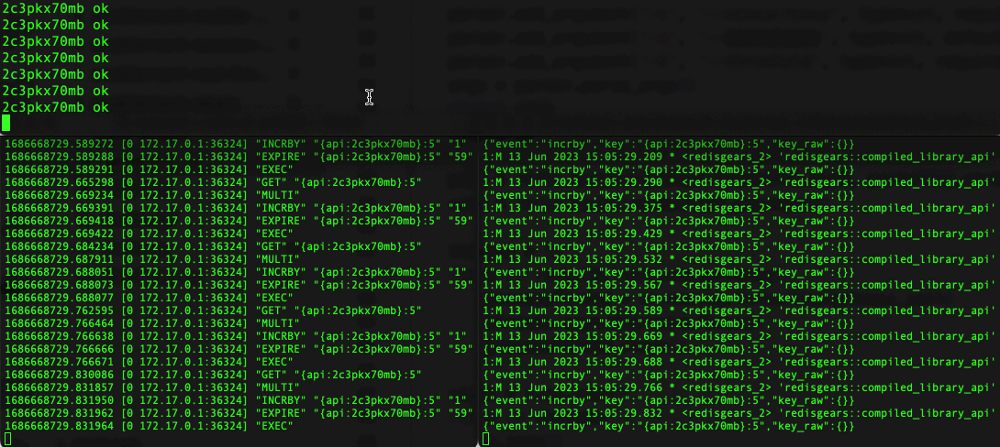

# Redis Rate Limiter

In the rate-limiting use case, each user token is allowed a certain number of requests in a limited amount of time. One of the simplest algorithms that solve this problem is the "Fixed window counter" algorithm which checks the number of calls in a specific time interval.  Implementing this algorithm with Redis is straightforward and is based on counters. The traditional logic of a rate limiter implies that the API gateway checks the current calls in a specific minute.

```
GET {[user-api-key]}:[current minute number]
```

> an example of counter per token and per minute is `{api:0ubo9qku7y}:54`, where we use curly brackets around a portion of the counter name to co-locate all the counters for a token in the same shard and together with additional data, as explained in the next section.

If the counter is under a threshold, we increase it using the following transaction and allow the request from the client. Otherwise, we deny the operation until the next minute, when we will restart the count with a new counter.

```
MULTI
INCR {[user-api-key]}:[current minute number]
EXPIRE {[user-api-key]}:[current minute number] 59
EXEC
```

## Prerequisites

To run the project yourself, you will need:
- [Redis](https://redis.io/) with the [Triggers and Functions](https://github.com/RedisGears/RedisGears#run-using-docker) module.
- Redis-cli
- [git](https://git-scm.com/download) command line tools.
- [Node.js](https://nodejs.org/) and [npm](https://www.npmjs.com)
- [Python](https://www.python.org/)

## An enhanced Rate Limiter

This basic implementation for a rate limiter can be expanded by adding per-token additional data, such as the last-updated timestamp. A proposal to extend the basic rate limiter *without making any changes to the application* involves using Triggers with JavaScript functions. Extending the basic rate limiter in this way can be achieved without impacting the application servers, as described below:

1. The existing counter `{[user-api-key]}:[current minute number]` keeps track of the number of requests per token in the current minute.
2. We attach a keyspace trigger that executes a JavaScript function whenever a counter is incremented.
3. When the counter is incremented, we store the last updated timestamp in a Hash co-located in the same shard as the counter itself, using a hashtag, for example `{[user-api-key]}:data`. Additional information can be stored in the Hash, such as the total number of requests for that token.


## Setup of the demo

This is a server-side rate limiter written in JavaScript and uses triggers to detect events on the API counters. 

You can test this proof-of-concept using the latest Docker image including the "Triggers and Functions" feature. Start a container as follows:

```
docker run -d --name my-redis-stack -p 6379:6379 redis/redis-stack:7.2.0-RC3
```

Clone this repository and import the Javascript library into the Redis Server. Npm is used to automate the deployment of the Triggers and Functions library.

In the package.json use the scripts section to add:
```Json
"scripts": {
    "deploy": "echo \"Deploying\"; redis-cli -x TFUNCTION LOAD REPLACE < ./src/limiter.js"
  }
```

To deploy the Triggers and Functions:

```
npm run deploy
```

A load generator is provided and written in Python. Now prepare the Python environment:

```
python3 -m venv limiter
source limiter/bin/activate
pip install redis
```

And start the demo as follows:

```
python3 generator.py --host localhost --port 6389 --concurrency 3 --threshold 100
```

Options to configure the load generator are:

```
--host          Host (default: 127.0.0.1)
--port          Port (default: 6379)
--user          User
--password      Password
--concurrency   Concurrency
--iterations    Iterations
--threshold     Allowed operations per minute
```



## Limiter.js

The `limiter.js` file contains the trigger registration and the callback function that is executed on each event for the keys starting with the `{api:` prefix.

The trigger registration
```JavaScript
redis.registerKeySpaceTrigger('limiter', '{api:', function(client, data){ ... });
```

- `limiter`: The name of the trigger.
- `{api:`: Key prefix where to listen to changes.
- `function(client, data){...}`: The callback signature containing a client to execute Redis commands and the data we receive from the trigger.

Within the callback function we define what events to react to. The `redis` object can be used for registering functions, triggers and logging.

```JavaScript
redis.registerKeySpaceTrigger('limiter', '{api:', function(client, data){
    if((data.event == 'incrby') || (data.event == 'incr')){
        
        // log the event
        redis.log(JSON.stringify(data));
    }
});
```

If the event is generated because of a `incrby` or `incr` event, the business logic is applied and the `client` object is used to `call()` a command on the Redis Server.

```JavaScript
// get the token identifier
const tokenApi = data.key.split(":").slice(0, -1).join(":");

// build the Hash name, e.g.: {api:5I68T5910K}:data
// the use of curly brackets is to co-locate the data with the counter
const tokenApiData = `${tokenApi}:data`;

// get the current timestamp
var curr_time = client.call("time")[0];

// add data to the Hash
client.call('hset', tokenApiData, 'last', curr_time);
client.call('hincrby', tokenApiData, 'ops', '1');
```

## Further developments

The same keyspace trigger can enhance the rate limiter with additional functionality, such as:

- Data in Hash data structures can be indexed, and querying the user metadata space with `FT.SEARCH` can provide useful information such as the oldest and newest token usage, sorting tokens by usage, sorting tokens by the total number of requests, and more.
- storing all the requests in a per-token time series, enabling token usage analytics (usage during a time window, averages, etc.).
